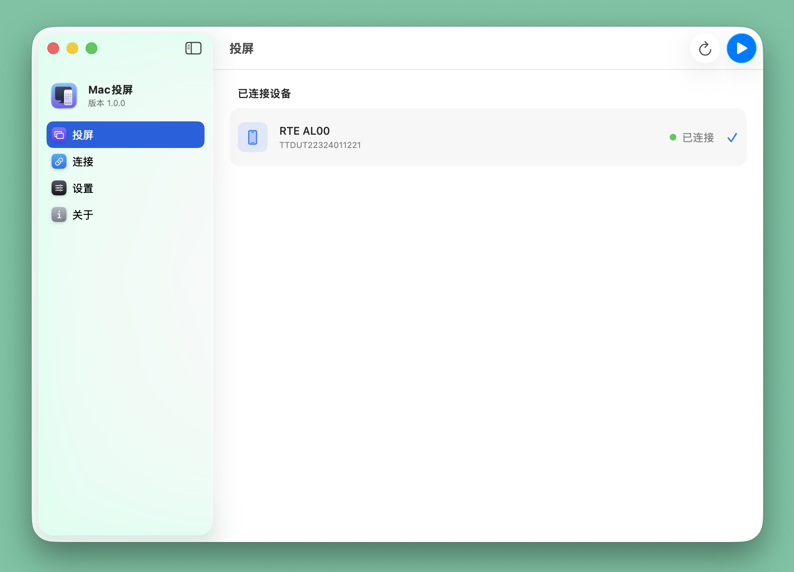
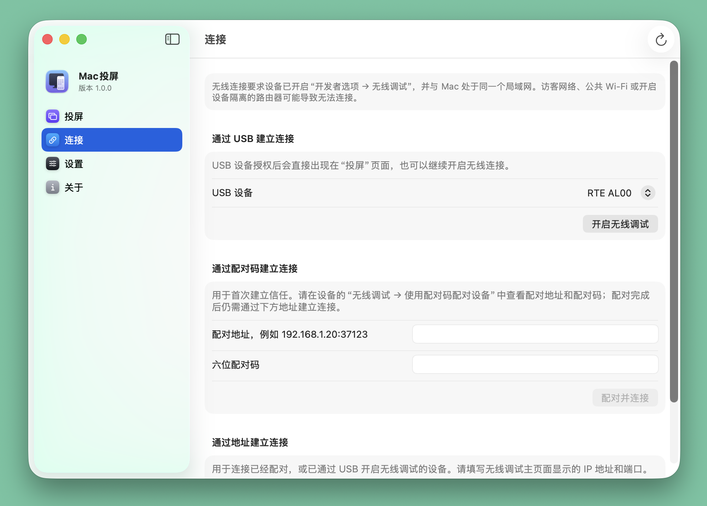
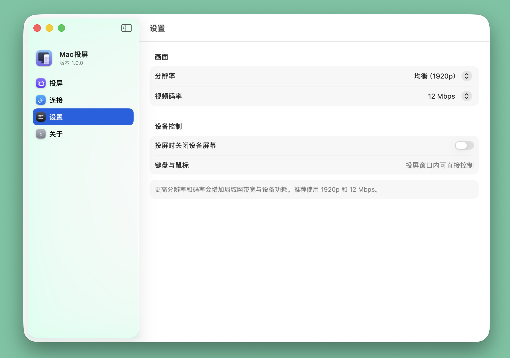
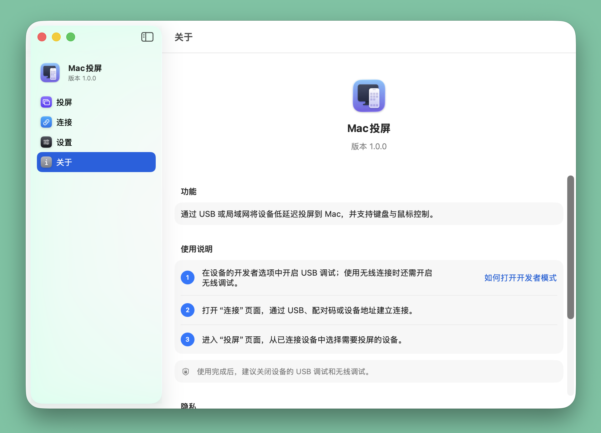

# Mac投屏

本项目以 MIT License 开源。应用内置的 scrcpy 和 Android Platform Tools 分别遵循其原项目许可证，相关声明随应用包提供。

一个轻量的原生 macOS 应用，通过 ADB + scrcpy 将设备低延迟投屏到 Mac，并支持键盘、鼠标控制。

## 界面示例

下面是当前版本的界面截图：









## 支持范围

- 支持 macOS 作为接收端，支持开启 ADB 调试的 Android 手机和平板设备。
- 当前不支持纯血鸿蒙（HarmonyOS NEXT）设备。旧版带 Android 兼容层的 HarmonyOS 设备可能可以使用，取决于设备是否提供 ADB。
- 当前不支持 iPhone 和 iPad。Apple 设备请使用 macOS 自带的“iPhone 镜像”或 AirPlay。

## 使用

1. 打开 `dist` 中的“Mac投屏.app”，Mac 不需要安装 Homebrew、ADB 或 scrcpy。
2. 在设备上开启开发者选项和“USB 调试”（部分系统若需控制，还要开启“USB 调试（安全设置）”）。
3. 通过 USB 连接设备，并在设备上允许调试。
4. 选择设备，点击“开始投屏”。

无线使用有两种方式：

- 先用 USB 连接，开启无线调试，断开 USB 后填写设备的局域网 IP。
- Android 11+ 可在“开发者选项 → 无线调试 → 使用配对码配对设备”中取得配对地址和配对码，先配对，再使用无线调试主页面显示的连接地址进行连接。

Mac 与设备需要在同一局域网。公共 Wi-Fi 可能启用了设备隔离，导致无法连接。

## 构建

```bash
./scripts/build-portable-app.sh
```

构建脚本从 scrcpy 官方 GitHub Release 和 Google Android 官方地址下载便携组件，校验 scrcpy 发布包后生成独立 `.app`。应用只在本机调用包内的 `adb` 与 `scrcpy`，不上传屏幕内容。
